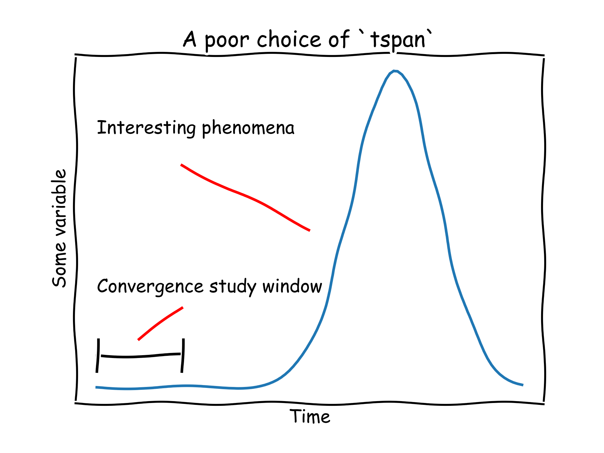

# ODEConvergenceTester.jl

A simple package for testing convergence rates for [SciMLBase.jl](https://github.com/SciML/SciMLBase.jl)'s problems, see the [integrator interface](https://diffeq.sciml.ai/stable/basics/integrator/#integrator) for the input arguments to `SciMLBase.init`.

|||
|---------------------:|:----------------------------------------------|
| **GHA CI**           | [![gha ci][gha-ci-img]][gha-ci-url]           |
| **Code Coverage**    | [![codecov][codecov-img]][codecov-url]        |
| **Bors enabled**     | [![bors][bors-img]][bors-url]                 |

[gha-ci-img]: https://github.com/CliMA/ODEConvergenceTester.jl/actions/workflows/ci.yml/badge.svg
[gha-ci-url]: https://github.com/CliMA/ODEConvergenceTester.jl/actions/workflows/ci.yml

[codecov-img]: https://codecov.io/gh/CliMA/ODEConvergenceTester.jl/branch/main/graph/badge.svg
[codecov-url]: https://codecov.io/gh/CliMA/ODEConvergenceTester.jl

[bors-img]: https://bors.tech/images/badge_small.svg
[bors-url]: https://app.bors.tech/repositories/41786

## Example

```julia
import SciMLBase
# Below, `prob` `alg` and `kwargs` are the same as those passed to:
# integrator = SciMLBase.init(prob, alg; kwargs...)

import ODEConvergenceTester
ODEConvergenceTester.refinement_study(
    prob,
    alg;
    refinement_range = 1:3, # 2:4 is more fine than 1:3
    kwargs...
)
```

an example output might look like

```
[ Info: ------ Convergence parameters ------
[ Info: nsteps                    : [2048.0, 4096.0, 8192.0, 16384.0, 32768.0]
[ Info: refinement factors        : [2.0, 2.0, 2.0, 2.0]
[ Info: dts                       : [0.00048828125, 0.000244140625, 0.0001220703125, 6.103515625e-5, 3.0517578125e-5]
[ Info: tfinal (rounded)          : [1.0, 1.0, 1.0, 1.0, 1.0]
[ Info: --- Running convergence study... ---
@timing iteration 1:  0.000266 seconds (2.07 k allocations: 321.625 KiB)
@timing iteration 2:  0.000634 seconds (4.12 k allocations: 685.812 KiB)
@timing iteration 3:  0.001551 seconds (8.21 k allocations: 1005.812 KiB)
@timing iteration 4:  0.002754 seconds (16.41 k allocations: 2.207 MiB)
@timing iteration 5:  0.004693 seconds (32.80 k allocations: 4.881 MiB)
[ Info: ----- Convergence study output -----
[ Info: Errors                    : [5.610290228252879e-5, 2.8054585866632564e-5, 1.4028076611882767e-5, 7.01423422078129e-6]
[ Info: Convergence orders        : [0.9998387890861984, 0.9999194015833588, 0.999959703467772]
[ Info: Expected convergence order: 1.0
[ Info: ------------------------------------
```

## Warning

It's important that the integrator's `tspan` is configured carefully so that your convergence study window captures sufficient phenomena of interest. More simply:



